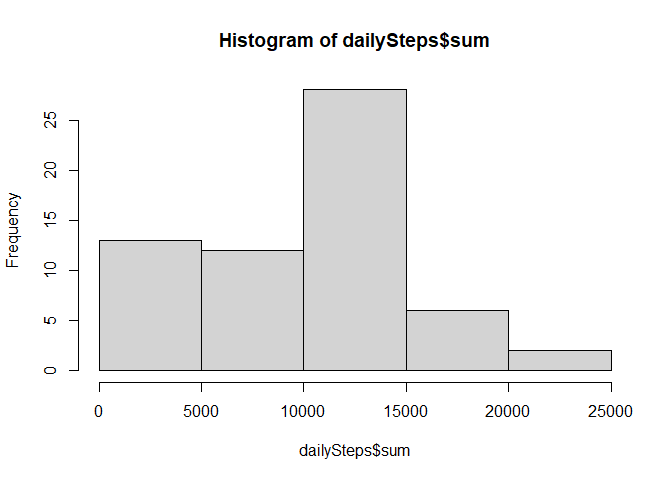
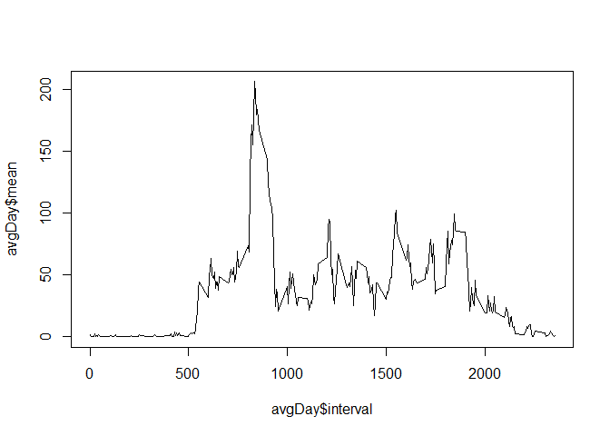
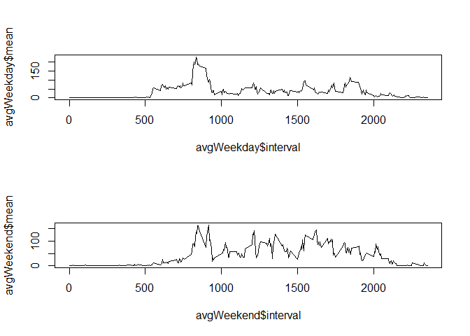

# Introduction

The purpose of this document is to read and analyze data from a personal activity monitoring device. We will examine daily patterns as well as look for weekly trends. 

# Analysis

Here we will conduct our primary analysis of the data.

## Loading and preprocessing the data

First we will begin by taking a first look at the data by loading it and generating some basic summary statistics and plots. To begin we will first import the data into R as the variable ```amd``` (activity monitoring data) and examine it.


```r
amd <- read.csv('activity.csv')
head(amd)
```

```
##   steps       date interval
## 1    NA 2012-10-01        0
## 2    NA 2012-10-01        5
## 3    NA 2012-10-01       10
## 4    NA 2012-10-01       15
## 5    NA 2012-10-01       20
## 6    NA 2012-10-01       25
```
As we can see there are a ton of ```NA``` values. These will need to be dealt with eventually. For now, let's just look at the total number of steps taken per day. To do this, first let's coerce the date column into the ```date``` class for easier processing.


```r
amd$date <- as.Date(amd$date, format = "%Y-%m-%d")
```

## What is mean total number of steps taken per day?

To summarize by dates we can use the ```dplyr``` libraries ```group_by``` function.


```r
library(dplyr)
```

```
## 
## Attaching package: 'dplyr'
```

```
## The following objects are masked from 'package:stats':
## 
##     filter, lag
```

```
## The following objects are masked from 'package:base':
## 
##     intersect, setdiff, setequal, union
```

```r
dailySteps <- amd %>% 
  group_by(date) %>% 
  summarise(sum(steps, na.rm = TRUE))
```

We now have a ```data.frame``` of all our daily step totals. Let's look at a histogram of these sums. To do so first let's rename the second column something more descriptive and easier to type. Then, since ```hist``` only takes numeric inputs, we will coerce the sums from the ```integer``` class to  the ```numeric``` class. Finally, we can generate the histogram.


```r
names(dailySteps)[2] <- "sum"
dailySteps$sum <- as.numeric(dailySteps$sum)
hist(dailySteps$sum)
```

<!-- -->

As a final step of our first look at the data let's examine the mean and median of the daily step totals.


```r
dsMean <- mean(dailySteps$sum)
dsMedian <- median(dailySteps$sum)
```

The mean daily steps taken is 9354.2295082 and the median daily steps taken is 1.0395\times 10^{4}

## What is the average daily activity pattern?

Now that we have a general grasp of the data, let's move on to looking at activity as it occurs throughout the day. Let's do this by first by averaging the data across the ```intervals``` variable to create an "average day".


```r
avgDay <- amd %>% 
  group_by(interval) %>% 
  summarise(mean(steps, na.rm = TRUE))

names(avgDay)[2] <- "mean"
```

Now let's plot this average across time (i.e. interval).


```r
plot(avgDay$interval, avgDay$mean, type = "l")
```

<!-- -->

As we can see by the plot there is a large spike around the 800 or 900 interval mark. Let's figure out exactly where the activity spikes.


```r
maxIndex <- which.max(avgDay$mean)
maxInterval <- avgDay$interval[maxIndex]
maxMean <- max(avgDay$mean)
```

So, the maximum average activity (206.1698113 steps) occurs at interval 104 which corresponds to the 835 interval.

## Imputing missing values

As we noted earlier, there are a lot of missing values. This can introduce biases into some of the analyses we are doing. First let's examine our missing data by determining exactly how many missing values we have.


```r
numNA <- sum(is.na(amd$steps))
totObs <- length(amd$steps)
percentNA <- round((numNA/totObs)*100, digits = 2)
```

Looks like 2304 out of 17568 observations are ```NA```, which is 13.11% of the data. Let's fill in the ```NA``` values by substituting them with the average value for that interval across all days. We will store this new data in a variable called ```amdComplete```. To do this, let us first create a function which will take one day worth of data, ```x```, and replace all the ```NA``` values with values from the average at that interval, ```y``` and return the completed vector. 


```r
replace_with_avg <- function(x, y) {
  NAs <- is.na(x)
  x[NAs] <- y[NAs]
  x
}
```

Now let's apply this function to our ```amd``` dataset and store the result in ```amdComplete```.


```r
numDays <- 61
amdComplete <- amd
for (i in 1:numDays) {
  startIndex <- 288*(i-1)+1
  endIndex <- 288*i
  x <- amdComplete$steps[startIndex:endIndex]
  amdComplete$steps[startIndex:endIndex] <- replace_with_avg(x,avgDay$mean)
}
```

Now that we have filled in the missing values, let's re-run some of out summary statistics and see how they have changed.


```r
dailyStepsComplete <- amdComplete %>% 
  group_by(date) %>% 
  summarise(sum(steps, na.rm = TRUE))

names(dailyStepsComplete)[2] <- "sum"
dailyStepsComplete$sum <- as.numeric(dailyStepsComplete$sum)
hist(dailyStepsComplete$sum)
```

<!-- -->

```r
dsMeanComplete <- mean(dailyStepsComplete$sum)
dsMedianComplete <- median(dailyStepsComplete$sum)
```

The new mean daily steps taken is 1.0766189\times 10^{4} and the median daily steps taken is 1.0766189\times 10^{4}. As you can see both number are higher that the original values (mean:9354.2295082; median:1.0395\times 10^{4}). It would seem that substituting missing values for average values shifts the average up.

## Are there differences in activity patterns between weekdays and weekends?

As a final level of analysis, let us look at how activity differs during weekdays as opposed to weekends. To do this we must first create a factor variable which splits the data into two levels (weekdays and weekends).


```r
amdComplete <- mutate(amdComplete, weekday = factor(weekdays(date) == "Saturday"
                | weekdays(date) == "Sunday", labels = c("weekday", "weekend")))
```

Now let's compute an average steps across time for the average weekday/weekend.


```r
avgWeekday <- amdComplete %>%
  filter(weekday == "weekday") %>%
  group_by(interval) %>% 
  summarise(mean(steps))
names(avgWeekday)[2] <- "mean"

avgWeekend <- amdComplete %>%
  filter(weekday == "weekend") %>%
  group_by(interval) %>% 
  summarise(mean(steps))
names(avgWeekend)[2] <- "mean"
```

Now that we have our intervalwise average steps for weekdays and weekends, let's look at a plot of the data.


```r
par(mfrow = c(2, 1))
plot(avgWeekday$interval, avgWeekday$mean, type = "l")
plot(avgWeekend$interval, avgWeekend$mean, type = "l")
```

<!-- -->

As you can see by the plots, the weekends tend have peak later in the morning than weekdays. Additionally, weekday activity tends to be concentrated in the mornings with very little activity in the afternoon into evening. Weekends however has peaks and troughs which occur sporadically into late into the evening.

# Conclusion

Hopefully this quick peek into data from a personal activity monitoring device has given you an insite into what the data looks like, as well as pointed out some interesting trends in the data.
